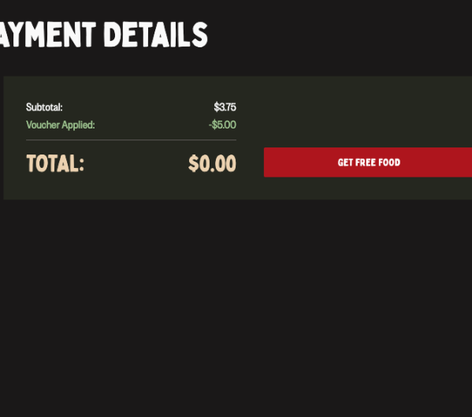

Red Rooster is the sixth biggest restaurant in Australia, known for their fried chicken and chips. They have around 350 stores spread across the country and are a popular choice for many Australians when they want a quick meal.

One Friday night, I was feeling hungry and decided to order Red Rooster for dinner using their mobile app. The mobile app allows customers to order and pay for food; the app also allows customers to create an account to get rewards and vouchers. I had previously created an account and had a few vouchers saved up, so I decided to use them to get a discount on my order.

After eating my succulent chicken and chips, I decided to check my account to see how the website determines the vouchers that are available to me. I opened the developer tools in my browser and looked at the network requests that the website was sending. I discovered that the website was sending a request to an API endpoint to get the vouchers that were available to me. I thought about ways to spoof the response from the API to get more vouchers, but the only software that I knew did this is unavailable on macOS.

So instead of spoofing the vouchers available to me, I continued looking through the network requests to find a URL containing a JSON list of every voucher available to every user. I wrote code to fetch the JSON list of vouchers and ask the user what voucher they would like to use. The program would then make a QR code using the `dcode` found in the JSON list and save it to a file for the user to scan in store. For those interested, the URL of the JSON list of vouchers is:
[https://content-acl.redrooster.com.au/all_loyalty_voucher_info.json](https://content-acl.redrooster.com.au/all_loyalty_voucher_info.json)

I later realized that the `dcode` is not used to identify the voucher for the user, rendering the program useless.

After some more time tinkering with the website dev tools, I discovered that if you apply a $5 discount voucher to your order, the server will remove the value of the voucher from the total cost of the order, but there is an issue: in order to get the discount, you need to have spent at least $15 on your order. But I found a way to bypass this by messing with the `cart` variable in the session storage in the browser.

The `cart` variable is a JSON object that contains the items in your cart, the total cost of the items in your cart, and a list of all the vouchers you applied to your cart, which contains all the conditions of the voucher. I found that if I changed the `minimumSpend` variable to `0` and set the sessions storage variable to the modified JSON object, the website would think that the voucher was to get a $5 discount on any order, regardless of the total cost.

```json
{
    "voucher": {
        "data": {
            "voucherName": "$5 OFF your next order",
            "pluCode": "D1900087",
            "voucherStatus": "ACTIVE",
            "redemptionsAllowed": 1,
            "redeemableAt": ["All stores"],
            "voucherValue": 5,
            "minimumSpend": 0,
        }
    }
}
```



Perfect, I had figured out a way to get a $5 discount on any order, regardless of the overall price. But if I wanted to get a burger or anything else that cost more than $5, I would need to find a way to figure out how to set the `total` variable in the cart object to $0. So I tried just that; I set the `total` variable to `0`, and the website accepted the total price of the order as $0. I had successfully found a way to get unlimited free food from Red Rooster.

The code below shows an example of the cart variable in the session storage.

```json
{
    "data": [
        {
            "cartId": "6eb241ba",
            "categoryName": "Drinks & Desserts",
            "productSlug": "375ml-drinks",
            "name": "375ml Drinks",
            "price": 375,
            "quantity": 1,
            "total": 375,
            "selected": [
                {
                    "subItemName": "375ml Soft Drink",
                    "selected": [
                        {
                            "name": "375ml 7up",
                            "price": 0
                        }
                    ]
                }
            ],
            "itemPrice": 375
        }
    ],
    "total": 375,
    "deliveryFee": 0
}
```

```json
{
    "data": [
        {
            "cartId": "6eb241ba",
            "categoryName": "Drinks & Desserts",
            "productSlug": "375ml-drinks",
            "name": "375ml Drinks",
            "price": 375,
            "quantity": 1,
            "total": 375,
            "selected": [
                {
                    "subItemName": "375ml Soft Drink",
                    "selected": [
                        {
                            "name": "375ml 7up",
                            "price": 375
                        }
                    ]
                }
            ],
            "itemPrice": 375
        }
    ],
    "total": 0, // Manipulated total
    "deliveryFee": 0
}
```

This is very cool but has a downside, the main one being it only works with pickup in-store orders, no delivery; this is because the delivery is controlled by DoorDash. Other than that, it is a very easy way to get free food from Red Rooster.

So yeah, that is how I hacked Red Rooster to get unlimited free food. If you have any questions or work at Red Rooster and want to contact me, feel free to [email me](mailto:redroosterexploit@jackweller.me). If you enjoyed reading this article, please consider sending [me some bitcoin](bitcoin:bc1pz33pxxuxz4jcapkulr5k0haf2kednfwev7xkvcvhdh2rp2qy0rds4nmdrl) so I can buy more Red Rooster, legally...

---

## Timeline of Events

- December 10, 2024: I discovered the exploit on Red Rooster's website, which allows manipulated orders to be placed without payment.
- December 11, 2024: I sent an email to Craveable Brands asking if they had a bug bounty policy, inquiring about how I could report security vulnerabilities.
- December 12, 2024: I called Craveable Brands' customer support and left a voicemail with my details, explaining the security vulnerability I had found.
- December 14, 2024: I sent Craveable Brands an email stating that I had found a security vulnerability and requesting the appropriate contact to report it.
- December 14, 2024: I documented all the details about the exploit, including its impact and potential fixes, to ensure clear and accurate communication of the issue.
- December 14, 2024: I sent Red Rooster an Instagram DM stating that I had found a security vulnerability and requesting the appropriate contact to report it.
- December 16, 2024: I left a comment on their latest post informing them to check their direct messages since I have found a security vulnerability.
- December 18, 2024: I sent Craveable Brands an Instagram DM following up on the last message, asking who I should contact.
- December 23, 2024: I sent a bug report in the Red Rooster app, asking them to send me an email.
- January 28, 2025: I sent a message to their contact form on their website, telling them what I had found.
- **January 29, 2025: I recieved an email from Craveable Brands asking for more information.**
- January 30, 2025: I responded with the document below.
---


[Download the full documentation of the exploit.](./assets/Documentation.docx)
